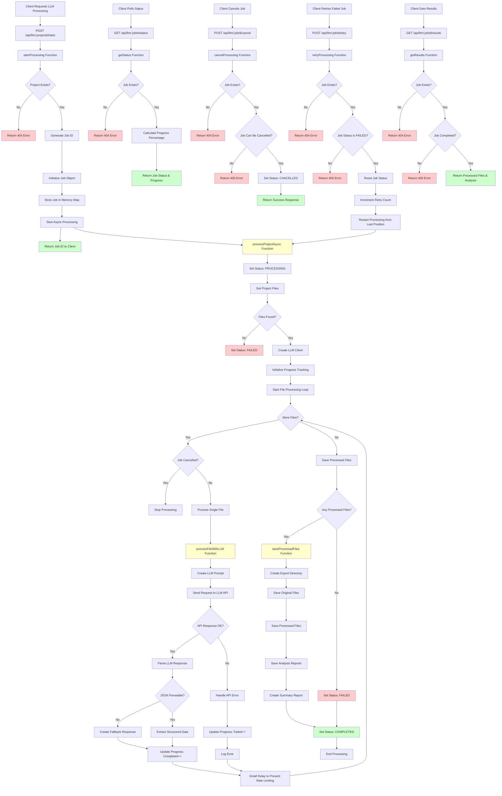

# LLM Processing Flow

This document describes the LLM processing flow implemented in `llmController.js`.

## Overview

The LLM controller handles asynchronous processing of project files through an external LLM API. It provides endpoints for starting, monitoring, canceling, and retrieving results from processing jobs.

## Processing Flow

## Key Components

### 1. Job Management
- **Job Storage**: In-memory Map for storing job states (production should use Redis/Database)
- **Job States**: PENDING → PROCESSING → COMPLETED/FAILED/CANCELLED
- **Progress Tracking**: Tracks total, completed, failed, and current file being processed

### 2. File Processing
- **File Discovery**: Recursively scans project files directory
- **File Filtering**: Only processes relevant file types (.js, .ts, .json, .md, .yml, .html, .css, .scss)
- **Sequential Processing**: Processes files one by one to avoid overwhelming the API

### 3. LLM Integration
- **API Client**: Creates axios client with configurable endpoint and API key
- **Request Format**: Sends structured prompts to OpenAI-compatible API
- **Response Parsing**: Attempts to parse JSON responses, falls back to plain text
- **Error Handling**: Handles rate limits, authentication errors, and timeouts

### 4. Result Storage
- **Export Structure**: Organizes results into original/, processed/, and reports/ directories
- **File Preservation**: Keeps original files alongside processed versions
- **Analysis Reports**: Stores detailed analysis for each file in JSON format
- **Summary Generation**: Creates overall summary of the processing job

### 5. API Endpoints
- `POST /api/llm/:projectId/start` - Start processing
- `GET /api/llm/:jobId/status` - Get job status and progress
- `POST /api/llm/:jobId/cancel` - Cancel running job
- `POST /api/llm/:jobId/retry` - Retry failed job
- `GET /api/llm/:jobId/results` - Get final results

## Environment Configuration

The controller requires the following environment variables:
- `OPENAPI_ENDPOINT` - The LLM API endpoint URL (required)
- `OPENAPI_API_KEY` - The API key for authentication (optional)

## Error Handling

The system handles various error scenarios:
- **Project Not Found**: Returns 404 when project doesn't exist
- **API Errors**: Handles rate limits, authentication failures, and timeouts
- **File Processing Errors**: Continues processing other files when individual files fail
- **Cancellation**: Gracefully stops processing when requested
- **Retry Logic**: Allows restarting failed jobs from last successful point
