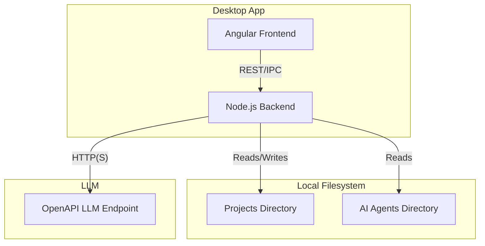
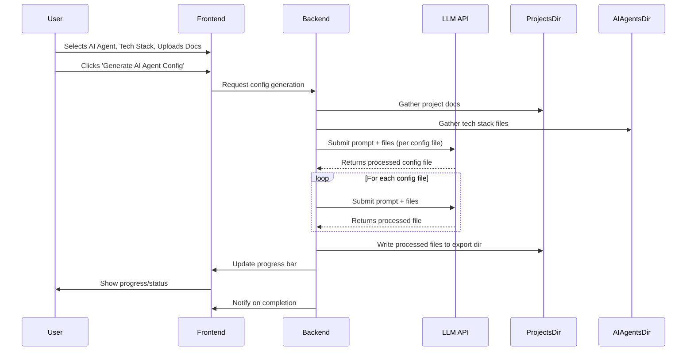
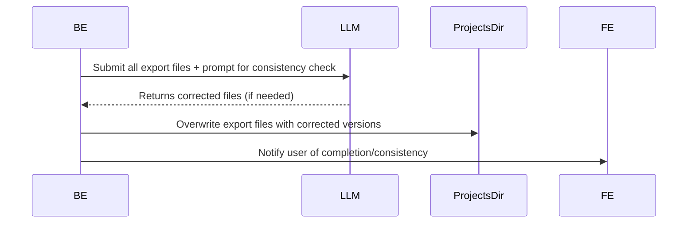
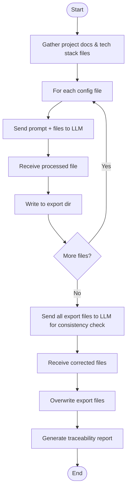

# System Architecture

## 1. High-Level Architecture Diagram



---

## 2. Key Components
- **Frontend (Angular):** Project management UI, file upload, tech stack selection, config generation, progress/status modals, traceability report viewer.
- **Backend (Node.js):** Filesystem orchestration, LLM API orchestration, prompt construction, progress tracking, error handling, post-processing consistency checks.
- **LLM (External, OpenAPI):** Receives prompt + files, returns processed/augmented config files and traceability report.

---

## 3. LLM Interaction Flow

### a. Initial Config Generation



### b. Post-Processing Consistency Check



---

## 4. LLM Prompt Design

### a. Per-File Generation Prompt

**System Prompt:**
```
You are an expert AI coding assistant. Your task is to generate or update the following configuration/instruction file so that it fully conforms to the project's standards and requirements.

- Use the project documents as the primary source of truth for requirements, best practices, and conventions.
- Where the project documents do not specify a requirement, use the relevant tech stack instruction files as the default standard.
- If there are conflicts between project documents and tech stack files, the project documents take precedence.
- Add missing items, remove or update items that conflict, and ensure the file is complete and self-consistent.
- All diagrams must be in Mermaid syntax.
- Do not introduce contradictions with other files in the export directory.

**Inputs:**
- The file to be generated/updated: [filename]
- Project documents: [list of files]
- Tech stack instruction files: [list of files]
```

**User Prompt Example:**
```
Please update the file [filename] using the attached project documents and tech stack files. Where the project documents are silent, use the tech stack files. Ensure all content is consistent, complete, and adheres to best practices. All diagrams must be in Mermaid syntax.
```

### b. Post-Processing Consistency Prompt

**System Prompt:**
```
You are an expert AI coding assistant. Review all files in the export directory for consistency and correctness.

- Ensure there are no contradictions or conflicting requirements between files.
- Where conflicts exist, resolve them in favor of the project documents, then tech stack files.
- Ensure all diagrams are in Mermaid syntax.
- Make corrections as needed and return the updated files.
```

**User Prompt Example:**
```
Please review all attached files for consistency. Resolve any contradictions, ensure all requirements are met, and that all diagrams use Mermaid syntax. Return the corrected files.
```

---

## 5. Consistency & Traceability
- After initial file generation, all export files are submitted together for a consistency check.
- The LLM returns corrected files, which overwrite the originals in the export directory.
- The traceability report is generated as a Markdown file, viewable in the browser, showing:
  - Which requirements were sourced from project docs vs. tech stack files
  - Any gaps or missing documentation
  - Completeness score

---

## 6. Additional Diagrams

### a. LLM Processing Flow


