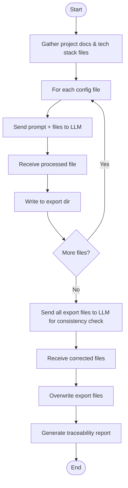

# System Requirements Document (SRD)
**Project:** Vibe Coding Accelerator
**Date:** August 2, 2025

---

## 1. Introduction
- Purpose: Define detailed system requirements for the Vibe Coding Accelerator, including LLM integration, prompt design, and consistency enforcement.

## 2. Functional Requirements
- Project CRUD operations (see PRDs)
- AI agent and tech stack selection (filesystem-driven)
- File upload, view, delete, rename (supported types only) ✅ *Completed in Task 0006*
- OpenAPI endpoint/API key management and validation
- Config generation via LLM (per file, with prompt as defined in system architecture)
- Post-processing consistency check via LLM (all export files)
- Traceability report generation (Markdown, browser-viewable)
- Progress bar and modal-based error handling for all LLM operations

## 3. Non-Functional Requirements
- Desktop-only, optimized for Safari, Chrome, Edge
- All file operations are local
- No authentication
- High-level error messages in UI; detailed errors in console
- All diagrams in Mermaid syntax

## 4. LLM API Contract
- Accepts prompt + files (multipart/form-data or similar)
- Returns processed files (same format)
- Handles partial failures, returns error details

## 5. Security & Privacy
- No external file uploads (local only)
- No sensitive data sent to LLM beyond project files/configs

## 6. Diagrams

### a. LLM Processing Flow

